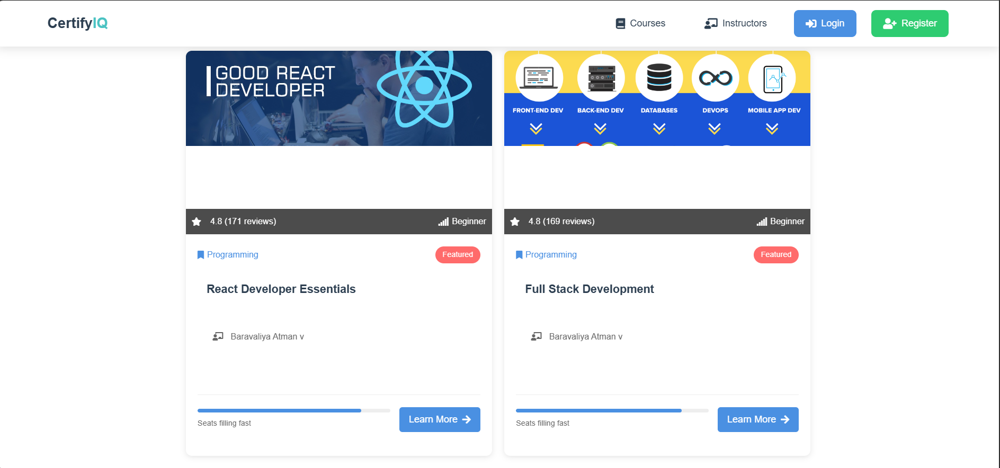
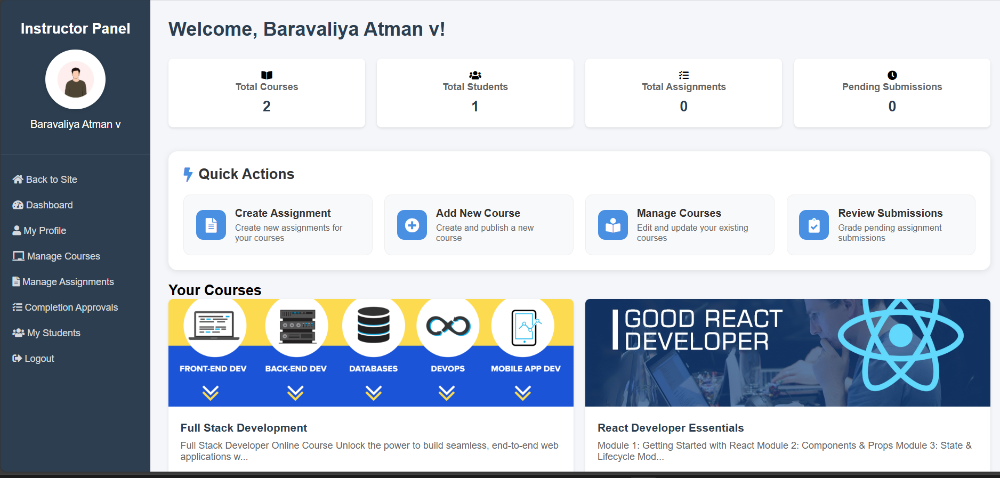

CertifyIQ Learning Platform
==========================

CertifyIQ is a web-based Learning Management System (LMS) built with PHP and MySQL. It supports students, instructors, and admins with features like course management, assignments, progress tracking, and certification.

--------------------------

FEATURES
--------
- User Roles: Student, Instructor, Admin
- Course Management: Create, edit, and manage courses, sections, and lessons
- Assignments: Submission, grading, and feedback
- Progress Tracking: Lesson and course completion tracking
- Payments: Course enrollment and payment management
- Calendar: Course schedules and deadlines
- Certificates: Issue certificates upon course completion
- Admin Dashboard: User and course management
- Instructor Dashboard: Manage courses, assignments, and students
- Student Dashboard: View enrolled courses, progress, and grades

--------------------------

PROJECT STRUCTURE
-----------------
lms0.1/
│
├── ajax/           # AJAX endpoints for dynamic content
├── api/            # REST-like API endpoints for core features
├── assets/         # CSS, JS, images
├── classes/        # PHP classes (e.g., CalendarManager)
├── config/         # Configuration and DB connection
├── database/       # SQL schema and migrations
├── includes/       # Common PHP includes (auth, header, footer, etc.)
├── pages/          # Main user-facing pages (login, dashboard, courses, etc.)
├── uploads/        # Uploaded files (assignments, course images, etc.)
├── index.php       # Landing page
└── pages.html      # (Optional) HTML sitemap or documentation

--------------------------

INSTALLATION
------------
1. Clone or Copy the Project
   - Place the `lms0.1` folder in your web server's root directory (e.g., `C:\xampp\htdocs\` for XAMPP).

2. Database Setup
   - Create a MySQL database named `lms_db`.
   - Import the schema:
     - Open phpMyAdmin or use the MySQL CLI.
     - Run the SQL script in `database/lms_schema.sql`.

3. Configuration
   - Edit `config/config.php` if needed:
     - Set your database credentials (`DB_USER`, `DB_PASS`).
     - Adjust `BASE_URL` and `SITE_NAME` as needed.

4. Uploads Folder
   - Ensure the `uploads/` directory and its subfolders (`assignments/`, `courses/`, `lessons/`, `profiles/`) are writable by the web server.

5. Start the Server
   - Start Apache and MySQL (if using XAMPP).
   - Visit http://localhost/lms0.1/ in your browser.

--------------------------

USAGE
-----
- Login/Register: Access via `/pages/login.php` or `/pages/register.php`
- Admin Dashboard: `/pages/admin/dashboard.php` (admin login required)
- Instructor Dashboard: `/pages/instructor/dashboard.php` (instructor login required)
- Student Dashboard: `/pages/dashboard.php` (student login required)
- Browse Courses: `/pages/courses.php`
- Course Details: `/pages/course.php?id=COURSE_ID`

--------------------------

DATABASE SCHEMA
---------------
See `database/lms_schema.sql` for all tables: users, courses, sections, lessons, enrollments, payments, assignments, assignment_submissions, course_schedules, course_completions, lesson_progress, testimonials, etc.

--------------------------

CUSTOMIZATION
-------------
- Styling: Edit files in `assets/css/`
- JavaScript: Edit files in `assets/js/`
- Images: Place images in `assets/images/`
- Add/Modify Pages: Edit or add PHP files in `pages/`

--------------------------

SECURITY NOTES
--------------
- Change default database credentials before deploying to production.
- Use HTTPS in production.
- Validate and sanitize all user inputs.

--------------------------

LICENSE
-------
This project is for educational purposes. Please add your own license if you plan to distribute it.

SCREENSHOT
-------

